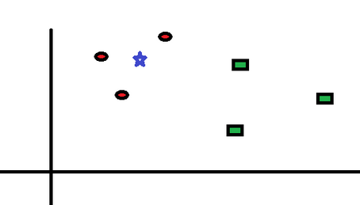
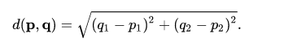
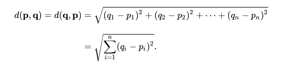

### 2.0 &nbsp;&nbsp;&nbsp;KNN (K-nearest neighbours)
KNN is a classic supervised learning algorithm that is used for both classification and regression problems. However, it is primarily used for classification problems. KNN is based on k nearest neighbors where k is an integer.

Suppose our data which has n features are scattered into [euclidean space](https://en.wikipedia.org/wiki/Euclidean_space) which might look like below if n=2.

Let's say red circles belong to class 1 and green rectangles belong to class 0 and they can be mathematically represented as (collectively they're called training data):
XG = [(a1, b1), (a2, b2), (a3, b3)]
XB = [(a1, b1), (a2, b2), (a3, b3)]

Now If I ask what is the class of a data point which is represented by the blue star (a, b)? (See above)
Most likely your (mine as well) answer would be class 1,
Now I ask why?
The intuitive answer would be because it is closer to class 1.
Perfect, right answer, congratulations! that's it that's the KNN.
In other words, we can say that the majority of the neighbors of data point (a, b) belong to class 1.
In KNN k is the number of neighbors we have to consider for predicting the class of a data point.
Now the problem arises how we will evaluate the k-neighbors and the solution to this, we will calculate the distance of each training point from input data(test data we say) and we will take k points which are nearest to the test data.
In case our data has two features we calculate the by:

But when our data will have n features we will have to calculate the [euclidean distance](https://en.wikipedia.org/wiki/Euclidean_distance)

A simple python script using numpy to calculate the euclidean distance:
nNumPysum((a - b)**2)**.5

#### Algorithm:

- calculate the distance of each training point from test data
- sort them into ascending order. 
- take the top k.
- find the majority class and that will be class for the given test data.
- repeat the same for all test data.

#### Source Code
	def distance(p1,p2):
		return np.sum((p2 - p1)**2)**.5

	def knn(X,Y,test,k=5):
        m = X.shape[0]

        d = []
        for i  in range(m):
            dist = distance(test,X[i])
            d.append((dist,Y[i]))

        d = np.array(sorted(d))[:,1]
        d = d[:k]
        t =  np.unique(d,return_counts=True)
        idx = np.argmax(t[1])
        pred = int(t[0][idx])

        return pred

- Don't forget to import numpy

Congratulations! Happy Coding.

